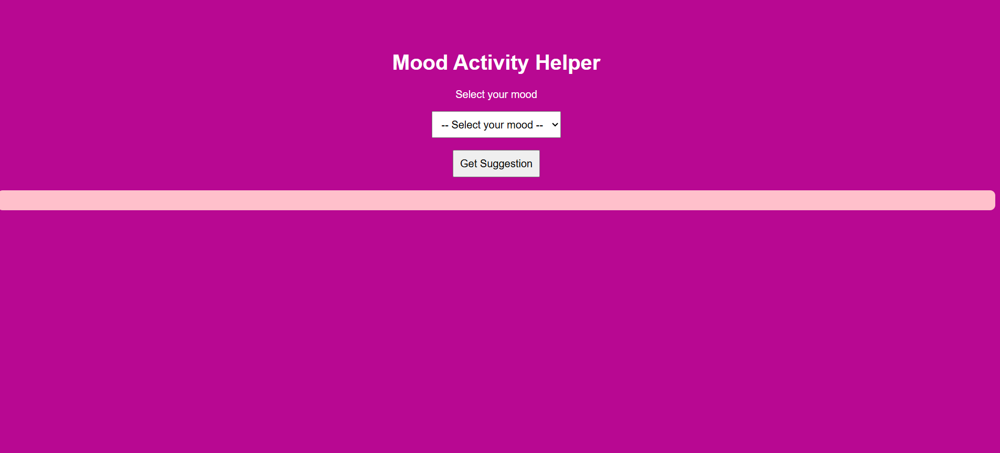
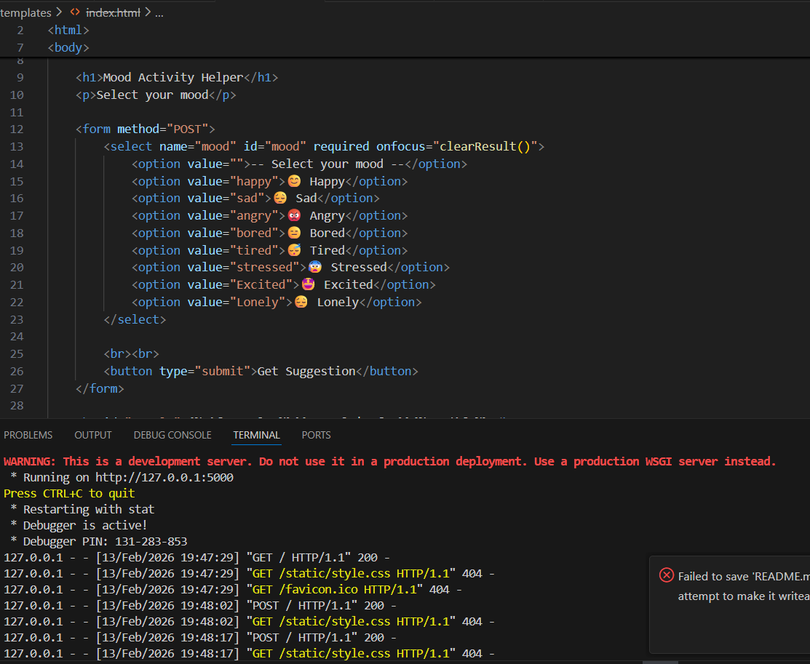
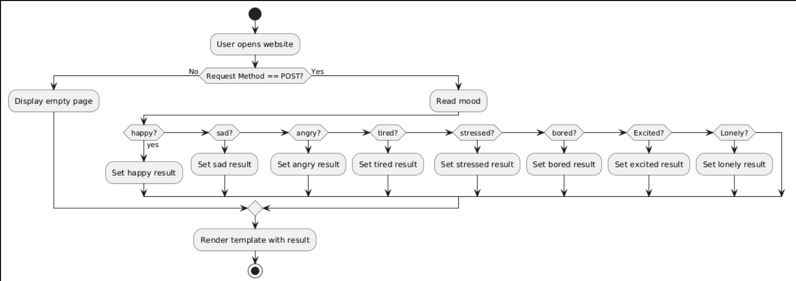
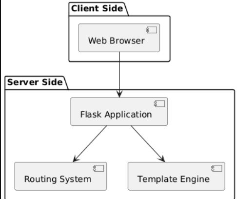

<p align="center">
  
</p>

# MOOD ACTIVITY WEBSITE 🎯

## Basic Details

### Team Name: Tech Tales

### Team Members
- Member 1: Kathu L - College Of Engineering And Managment Punnapra
- Member 2: Navya S Kumar - College Of Engineering And Managment Punnapra

### Hosted Project Link
[mention your project hosted link here]

### Project Description
This is a mood based activity
recommendation websites built using python flask
based on users moood ,the system suggest suitable activities,quotes and tips to support well-being

### The Problem statement
People experience different moods daily,and choosing the right activity can improve thier well being.it helps that lets users select thier mood from a dropdown and recieve and instant ,emoji based activity suggestion.The interface is simple,beginer friendly and initially blank to emphasize users interaction.

### The Solution
We solve the problem by letting the user select their mood from a dropdown and clicking “Get Activity”. A JavaScript function then shows a corresponding emoji-based activity in a blank result area. If no mood is selected, the area stays blank, making the interface simple and interactive.

---

## Technical Details

### Technologies
- Languages used: python flask,html,javascript,css
- Frameworks used: none
- Libraries used: none
- Tools used: VS code,Github,chrome,python/flask

---

## Features

List the key features of your project:
- Feature 1: Mood-Based Suggestions: Gives activity recommendations based on the user’s selected mood.
- Feature 2: Interactive: Shows suggestions only after the user clicks “Get Activity”.
- Feature 3: Emoji-Based Feedback: Uses emojis for visual appeal and easy understanding.
- Feature 4: Beginner-Friendly Interface: Simple dropdown and button, easy to use.

---

## Implementation

#### Installation
```bash
Installation commands -python app.py
```

#### Run
```bash
Run commands - python app.py
```

---

## Project Documentation

#### Screenshots (Add at least 3)

programme modified into website

python code

html code

#### Diagrams

**System Architecture:**

Request-Analyse mood-Generate result-Render output

**Application Workflow:**

Browser request are processed through routing and rendered via templates
---

## Project Demo

### Video

https://drive.google.com/file/d/1oAsljAvR8FqhRNvPTX5P6GyO7ZANn5zc/view?usp=sharing
it detect your mood and suggest simple activities,quotes and tip to better feel
### Additional Demos
https://drive.google.com/file/d/1oAsljAvR8FqhRNvPTX5P6GyO7ZANn5zc/view?usp=sharing
Amood based platform that turns emotions into positive actions
---

## Team Contributions

- Kathu:specific contributions -functionms
- Navya S Kumar :specific contribution-UI

---

## License

This project is licensed under the [MIT] License - see the [LICENSE](LICENSE) file for details.

---

Made with ❤️ at TinkerHub


